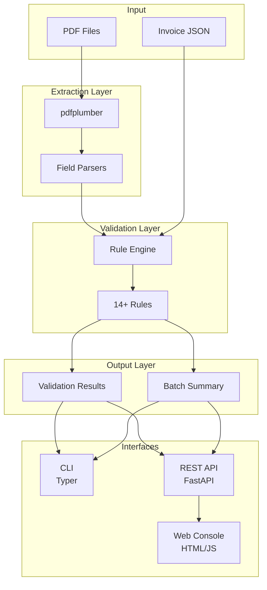

# Invoice Extraction & Quality Control Service

A production-quality Python service for extracting structured data from B2B invoice PDFs and validating them against configurable business rules.


## Overview

This service provides a complete pipeline for:

- **PDF Extraction**: Convert invoice PDFs to structured JSON using pdfplumber
- **Validation Engine**: Validate invoices against 14+ business rules
- **CLI Interface**: Command-line tools for batch processing
- **REST API**: FastAPI endpoints for integration
- **Web Console**: Browser-based QC interface for internal users

```
PDFs → Extraction → JSON → Validation → Reports/API/UI
```

## Features

### Implemented Components

| Component | Status | Description |
|-----------|--------|-------------|
| PDF Extractor | ✅ | Extract structured data from invoice PDFs |
| Validation Engine | ✅ | 14 validation rules across 4 categories |
| CLI | ✅ | `extract`, `validate`, `full-run` commands |
| REST API | ✅ | FastAPI with OpenAPI documentation |
| Web Console | ✅ | HTML/JS QC interface |
| Unit Tests | ✅ | pytest test suite |

---

## Schema & Validation Design

### Invoice Schema

The invoice data model captures essential B2B invoice information:

| Field | Type | Required | Description |
|-------|------|----------|-------------|
| `invoice_number` | string | ✓ | Unique invoice identifier assigned by seller |
| `external_reference` | string | | External reference (PO number, contract ID) |
| `seller_name` | string | ✓ | Legal name of the seller/vendor |
| `seller_tax_id` | string | | Seller's tax ID (VAT, GST, TIN) |
| `seller_address` | string | | Seller's business address |
| `buyer_name` | string | ✓ | Legal name of the buyer/customer |
| `buyer_tax_id` | string | | Buyer's tax identification number |
| `buyer_address` | string | | Buyer's billing address |
| `invoice_date` | date | ✓ | Date when invoice was issued |
| `due_date` | date | | Payment due date |
| `currency` | string | ✓ | ISO currency code (USD, EUR, INR, etc.) |
| `net_total` | float | ✓ | Subtotal before tax |
| `tax_amount` | float | ✓ | Total tax amount |
| `gross_total` | float | ✓ | Total amount due including tax |
| `payment_terms` | string | | Payment terms (Net 30, etc.) |
| `line_items` | array | | List of invoice line items |

#### Line Item Schema

| Field | Type | Required | Description |
|-------|------|----------|-------------|
| `description` | string | ✓ | Item or service description |
| `quantity` | float | ✓ | Number of units |
| `unit_price` | float | ✓ | Price per unit |
| `line_total` | float | ✓ | Total for this line |
| `tax_rate` | float | | Tax rate percentage |
| `unit_of_measure` | string | | Unit (pcs, hours, kg) |

---

### Validation Rules & Rationale

#### Completeness Rules

| Rule | Code | Rationale |
|------|------|-----------|
| Invoice number required | `missing_field:invoice_number` | Essential for tracking and reconciliation |
| Invoice date required | `missing_field:invoice_date` | Required for accounting and tax purposes |
| Seller name required | `missing_field:seller_name` | Must identify who issued the invoice |
| Buyer name required | `missing_field:buyer_name` | Must identify who should pay |
| Currency required | `missing_field:currency` | Financial amounts need currency context |

#### Format Rules

| Rule | Code | Rationale |
|------|------|-----------|
| Valid currency code | `format_error:currency` | Prevents processing errors from invalid currencies |
| Numeric totals | `format_error:totals` | Ensures amounts can be processed mathematically |

#### Business Rules

| Rule | Code | Rationale |
|------|------|-----------|
| Line items sum matches net | `business_rule:line_items_mismatch` | Catches extraction or data entry errors |
| Totals consistency | `business_rule:totals_mismatch` | Fundamental invoice equation: net + tax = gross |
| Valid due date | `business_rule:invalid_due_date` | Due date cannot be before invoice date |
| Line item calculation | `business_rule:line_item_calculation_error` | qty × price should equal line total |

#### Anomaly Rules

| Rule | Code | Rationale |
|------|------|-----------|
| Non-negative totals | `anomaly:negative_*` | Standard invoices shouldn't have negative amounts |
| Duplicate detection | `anomaly:duplicate_invoice` | Prevents double payments |
| Reasonable amounts | `anomaly:zero_value_invoice` | Zero or extremely high values need review |

---

## Architecture

```
invoice-qc-service/
├── invoice_qc/                 # Main Python package
│   ├── __init__.py            # Package exports
│   ├── config.py              # Configuration & constants
│   ├── schemas.py             # Pydantic data models
│   ├── rules.py               # Validation rule definitions
│   ├── extractor.py           # PDF → Invoice extraction
│   ├── validator.py           # Validation engine
│   ├── cli.py                 # Typer CLI application
│   └── api.py                 # FastAPI REST API
├── frontend/                   # Web-based QC console
│   ├── index.html             # Main HTML page
│   ├── styles.css             # CSS styling
│   ├── app.js                 # JavaScript logic
│   └── README.md              # Frontend docs
├── samples/                    # Sample data
│   └── pdfs/                  # Place invoice PDFs here
├── tests/                      # Test suite
│   ├── test_extractor.py      # Extraction tests
│   └── test_validator.py      # Validation tests
├── pyproject.toml             # Project dependencies
├── README.md                  # This file
├── .env.example               # Environment template
└── .gitignore                 # Git ignore rules
```

### Data Flow Diagram



---

## Setup & Installation

### Requirements

- Python 3.11 or higher
- pip package manager

### Installation Steps

1. **Clone the repository**
   ```bash
   git clone <repository-url>
   cd Invoice-Extraction-Quality-Control-Service
   ```

2. **Create virtual environment**
   ```bash
   python -m venv venv
   
   # Windows
   venv\Scripts\activate
   
   # Linux/macOS
   source venv/bin/activate
   ```

3. **Install dependencies**
   ```bash
   pip install -e .
   
   # For development (includes pytest)
   pip install -e ".[dev]"
   ```

4. **Verify installation**
   ```bash
   python -m invoice_qc.cli version
   ```

---

## Usage

### CLI Commands

#### Extract invoices from PDFs

```bash
python -m invoice_qc.cli extract \
  --pdf-dir ./samples/pdfs \
  --output extracted_invoices.json
```

#### Validate extracted invoices

```bash
python -m invoice_qc.cli validate \
  --input extracted_invoices.json \
  --report validation_report.json
```

#### Full pipeline (extract + validate)

```bash
python -m invoice_qc.cli full-run \
  --pdf-dir ./samples/pdfs \
  --report validation_report.json \
  --save-extracted extracted.json
```

### REST API

#### Start the server

```bash
uvicorn invoice_qc.api:app --reload --host 0.0.0.0 --port 8000
```

#### API Documentation

- Swagger UI: http://localhost:8000/docs
- ReDoc: http://localhost:8000/redoc

#### Example Requests

**Health Check**
```bash
curl http://localhost:8000/health
```

Response:
```json
{"status": "ok", "version": "0.1.0"}
```

**Validate JSON**
```bash
curl -X POST http://localhost:8000/validate-json \
  -H "Content-Type: application/json" \
  -d '{
    "invoices": [{
      "invoice_number": "INV-001",
      "seller_name": "Acme Corp",
      "buyer_name": "Global Inc",
      "invoice_date": "2024-01-15",
      "currency": "USD",
      "net_total": 1000.00,
      "tax_amount": 100.00,
      "gross_total": 1100.00,
      "line_items": []
    }]
  }'
```

**Upload PDFs**
```bash
curl -X POST http://localhost:8000/extract-and-validate-pdfs \
  -F "files=@invoice1.pdf" \
  -F "files=@invoice2.pdf"
```

### Web Console

1. Start the API server (see above)
2. Open `frontend/index.html` in a browser
3. Or serve with Python:
   ```bash
   cd frontend
   python -m http.server 8080
   ```
   Then visit http://localhost:8080

---

## Running Tests

```bash
# Install dev dependencies
pip install -e ".[dev]"

# Run all tests
pytest tests/ -v

# Run with coverage
pytest tests/ -v --cov=invoice_qc
```

---

## AI Usage Notes

### Tools Used

This project was developed with assistance from **Google Antigravity AI agent** for:

- **Project scaffolding**: Initial directory structure and file organization
- **Code generation**: Pydantic models, validation rules, CLI commands
- **Regex patterns**: Date parsing, amount extraction, invoice number detection
- **Test design**: pytest fixtures and test case structure
- **Documentation**: README structure and API documentation

### AI Limitations Encountered

1. **Date parsing complexity**: Initial AI-suggested regex patterns didn't handle all date formats correctly (e.g., "15th January 2024"). Added the `python-dateutil` library as a fallback.

2. **Table extraction**: AI suggested simple line-based parsing which failed for complex multi-column tables. Switched to pdfplumber's table extraction which provides structured cell data.

3. **Duplicate detection state**: Initial implementation didn't persist the "seen invoices" set correctly across the batch. Required adding explicit context dictionary passing.

---

## Assumptions & Limitations

### Assumptions

1. **Invoice format**: Assumes invoices are text-based PDFs (not scanned images). For scanned documents, integrate OCR first.

2. **Language**: Extraction patterns are optimized for English-language invoices.

3. **Currency**: Supports 12 major currencies. Add more in `config.py` if needed.

4. **Single invoice per PDF**: Each PDF is assumed to contain one invoice.

### Known Limitations

1. **Complex layouts**: Highly designed invoices with unusual layouts may have extraction issues.

2. **Line item parsing**: Works best with clearly tabulated line items. Free-form descriptions may not parse correctly.

3. **Tax calculation**: Assumes single tax rate per invoice. Multiple tax rates (e.g., different VAT rates per item) are not fully supported.

4. **Languages**: Non-English invoices will have reduced extraction accuracy.

---

## Integration into a Larger System

### As a Microservice

The API can be deployed as a standalone microservice:

```yaml
# docker-compose.yml example
version: '3.8'
services:
  invoice-qc:
    build: .
    ports:
      - "8000:8000"
    environment:
      - LOG_LEVEL=INFO
```

### Queue Integration

For batch processing, integrate with a message queue:

```python
# Example: Processing from a queue
import redis
from invoice_qc import extract_invoice_from_bytes, validate_batch

r = redis.Redis()
while True:
    _, pdf_bytes = r.blpop("invoice_queue")
    invoice = extract_invoice_from_bytes(pdf_bytes)
    results, summary = validate_batch([invoice])
    r.rpush("validation_results", results[0].model_dump_json())
```

### Upstream OCR Integration

For scanned documents, add an OCR step before this service:

```
Scanned PDF → OCR Service → Text PDF → Invoice QC Service → Validation
```

### Dockerfile Outline

```dockerfile
FROM python:3.11-slim

WORKDIR /app
COPY pyproject.toml .
RUN pip install .

COPY invoice_qc/ invoice_qc/
EXPOSE 8000

CMD ["uvicorn", "invoice_qc.api:app", "--host", "0.0.0.0", "--port", "8000"]
```

---

## License

MIT License - See LICENSE file for details.